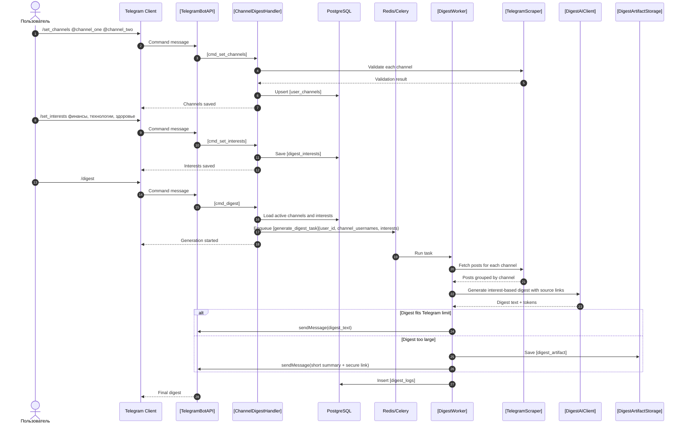

# Дайджест из нескольких каналов: System Design Document

## 1. Обзор (Overview)

Фича "Дайджест из нескольких каналов" позволяет пользователю выбрать до 5 публичных Telegram-каналов, описать свои интересы/сферы и получать единый дневной дайджест, сгруппированный по интересам, а не по источникам. Сейчас пользователь хранит один канал в `users.target_channel`, поэтому для полной картины дня ему приходится менять канал вручную или запускать несколько отдельных сценариев.

Бизнес-цели:

- Увеличить вовлеченность пользователей за счет более полезного ежедневного дайджеста.
- Повысить удержание пользователей, которым нужен обзор нескольких областей жизни.
- Снизить количество ручных действий для получения полной картины дня.
- Подготовить модель данных к будущим настройкам по каналам без повторной миграции ядра.

Метрики успеха:

- `[daily_digest_requests_per_user]` вырос на `[target_percent]`.
- `[scheduled_digest_enabled_users]` вырос на `[target_percent]`.
- `[multi_channel_users_share]` достиг `[target_percent]` от активных пользователей.
- `[digest_generation_error_rate]` не выше текущего уровня плюс `[acceptable_delta_percent]`.
- `[avg_digest_generation_duration_seconds]` не выше `[target_seconds]` для `[target_channel_count]` каналов.

## 2. Цели и Анти-цели (Goals and Non-Goals)

### Цели (Goals)

- Заменить хранение одного канала в `users.target_channel` на связь пользователя с несколькими каналами через `[user_channels]`.
- Добавить bot API для добавления, удаления, просмотра и полной замены списка каналов.
- Изменить ручную команду дайджеста так, чтобы она генерировала один общий дайджест по всем активным каналам пользователя.
- Добавить команду для сохранения пользовательских интересов/сфер, которые будут управлять структурой дайджеста.
- Группировать итоговый дайджест по интересам/сферам пользователя, сохраняя ссылки на источники в пунктах дайджеста.
- Изменить scheduled worker так, чтобы он обрабатывал всех активных пользователей с хотя бы одним активным каналом.
- Сохранить историю генераций в `[digest_logs]` с учетом нескольких каналов.
- Добавить валидацию каналов через текущий Pyrogram-подход перед сохранением.
- Обеспечить обратимую миграцию с существующего `users.target_channel`.
- Покрыть изменения unit-, integration- и минимальными E2E-тестами.

### Анти-цели (Non-Goals)

- Не добавляем свободные персональные промпты и веса каналов в этой итерации; пользователь задает только список интересов/сфер.
- Не добавляем приватные каналы, инвайт-ссылки и авторизацию от имени пользователя.
- Не добавляем веб-интерфейс, REST API или callback UI, потому что текущий MVP управляется только через Telegram commands.
- Не меняем провайдера AI и не переписываем текущую интеграцию OpenRouter.
- Не добавляем хранение файлов дайджеста, если текст помещается в Telegram-сообщение.
- Не внедряем новую очередь задач или новый ORM-паттерн.
- Не добавляем отдельные расписания для разных групп каналов.

## 3. Высокоуровневый дизайн (High-Level Design)



Основной флоу:

1. Пользователь задает список каналов командой `[set_channels_command]`.
2. Пользователь задает интересы/сферы командой `[set_interests_command]`.
3. Bot handler нормализует usernames, убирает дубли, проверяет лимит 5 каналов и доступность каждого канала через текущий Pyrogram scraper.
4. Список каналов сохраняется в PostgreSQL в таблице `[user_channels]`, интересы сохраняются в `[digest_interests]`.
5. При ручном или запланированном запуске worker получает все активные каналы и интересы пользователя.
6. Worker собирает посты за последние `[digest_period_hours]` часов по каждому каналу, объединяет их в один вход для AI и генерирует дайджест по интересам/сферам.
7. Результат отправляется пользователю через Telegram Bot API, а итог генерации сохраняется в `[digest_logs]`.

## 4. Детальный дизайн (Detailed Design)

### 4.1. Диаграмма компонентов (Component Diagram)

```mermaid
flowchart TD
    TelegramUser[Telegram User]
    BotRouter[[aiogram Router]]
    ChannelHandler[[[ChannelHandler]]]
    DigestHandler[[[DigestHandler]]]
    SettingsHandler[[[SettingsHandler]]]
    UoW[[[UnitOfWork]]]
    UserRepo[[[UserRepository]]]
    UserChannelRepo[[[UserChannelRepository]]]
    InterestRepo[[[DigestInterestRepository]]]
    DigestLogRepo[[[DigestLogRepository]]]
    DB[(PostgreSQL)]
    CeleryTask[[[GenerateDigestTask]]]
    Scheduler[[Celery Beat]]
    Scraper[[[TelegramScraper]]]
    AIClient[[[DigestAIClient]]]
    TelegramSender[[[TelegramMessageSender]]]
    Storage[[[DigestArtifactStorage]]]

    TelegramUser --> BotRouter
    BotRouter --> ChannelHandler
    BotRouter --> DigestHandler
    BotRouter --> SettingsHandler
    ChannelHandler --> Scraper
    ChannelHandler --> UoW
    DigestHandler --> UoW
    DigestHandler --> CeleryTask
    Scheduler --> CeleryTask
    CeleryTask --> UoW
    CeleryTask --> Scraper
    CeleryTask --> AIClient
    CeleryTask --> TelegramSender
    CeleryTask -. optional .-> Storage
    UoW --> UserRepo
    UoW --> UserChannelRepo
    UoW --> InterestRepo
    UoW --> DigestLogRepo
    UserRepo --> DB
    UserChannelRepo --> DB
    InterestRepo --> DB
    DigestLogRepo --> DB
```

### 4.2. Изменения в схеме данных (Database Schema Changes)

Новая таблица `[user_channels]`:

```sql
CREATE TABLE IF NOT EXISTS [user_channels] (
    id SERIAL PRIMARY KEY,
    user_id BIGINT NOT NULL REFERENCES users(telegram_id) ON DELETE CASCADE,
    channel VARCHAR(255) NOT NULL,
    is_active BOOLEAN NOT NULL DEFAULT TRUE,
    position INTEGER NOT NULL DEFAULT 0,
    created_at TIMESTAMPTZ NOT NULL DEFAULT NOW(),
    updated_at TIMESTAMPTZ NOT NULL DEFAULT NOW(),
    UNIQUE (user_id, channel)
);

CREATE INDEX IF NOT EXISTS [idx_user_channels_user_id]
    ON [user_channels](user_id);

CREATE INDEX IF NOT EXISTS [idx_user_channels_user_active]
    ON [user_channels](user_id, is_active);

CREATE INDEX IF NOT EXISTS [idx_user_channels_channel]
    ON [user_channels](channel);
```

Новая таблица `[digest_interests]`:

```sql
CREATE TABLE IF NOT EXISTS [digest_interests] (
    id SERIAL PRIMARY KEY,
    user_id BIGINT NOT NULL REFERENCES users(telegram_id) ON DELETE CASCADE,
    interest VARCHAR(100) NOT NULL,
    position INTEGER NOT NULL DEFAULT 0,
    created_at TIMESTAMPTZ NOT NULL DEFAULT NOW(),
    updated_at TIMESTAMPTZ NOT NULL DEFAULT NOW(),
    UNIQUE (user_id, interest)
);

CREATE INDEX IF NOT EXISTS [idx_digest_interests_user_id]
    ON [digest_interests](user_id);
```

Изменения в `[digest_logs]`:

```sql
ALTER TABLE [digest_logs]
    ADD COLUMN IF NOT EXISTS channels_count INTEGER NOT NULL DEFAULT 1,
    ADD COLUMN IF NOT EXISTS channels JSONB,
    ADD COLUMN IF NOT EXISTS interests JSONB;

CREATE INDEX IF NOT EXISTS [idx_digest_logs_user_created]
    ON [digest_logs](user_id, created_at DESC);
```

Миграция существующих данных:

```sql
INSERT INTO [user_channels] (user_id, channel, is_active, position)
SELECT telegram_id, target_channel, TRUE, 0
FROM users
WHERE target_channel IS NOT NULL
ON CONFLICT (user_id, channel) DO NOTHING;
```

Поле `users.target_channel` оставляем. Оно нужно для безопасного отката и совместимости старого кода. Удаление поля не входит в текущий скоуп.

SQLAlchemy-модели:

```python
class [UserChannel](Base):
    __tablename__ = "[user_channels]"

    id: Mapped[int] = mapped_column(Integer, primary_key=True, autoincrement=True)
    user_id: Mapped[int] = mapped_column(
        BigInteger,
        ForeignKey("users.telegram_id", ondelete="CASCADE"),
        nullable=False,
    )
    channel: Mapped[str] = mapped_column(String(255), nullable=False)
    is_active: Mapped[bool] = mapped_column(Boolean, default=True)
    position: Mapped[int] = mapped_column(Integer, default=0)
    created_at: Mapped[datetime] = mapped_column(DateTime(timezone=True), server_default=func.now())
    updated_at: Mapped[datetime] = mapped_column(DateTime(timezone=True), server_default=func.now(), onupdate=func.now())


class [DigestInterest](Base):
    __tablename__ = "[digest_interests]"

    id: Mapped[int] = mapped_column(Integer, primary_key=True, autoincrement=True)
    user_id: Mapped[int] = mapped_column(
        BigInteger,
        ForeignKey("users.telegram_id", ondelete="CASCADE"),
        nullable=False,
    )
    interest: Mapped[str] = mapped_column(String(100), nullable=False)
    position: Mapped[int] = mapped_column(Integer, default=0)
    created_at: Mapped[datetime] = mapped_column(DateTime(timezone=True), server_default=func.now())
    updated_at: Mapped[datetime] = mapped_column(DateTime(timezone=True), server_default=func.now(), onupdate=func.now())
```

### 4.3. API Endpoints

Текущая архитектура проекта не использует HTTP REST endpoints. Пользовательский API реализован только через Telegram commands. Ниже описаны новые и изменяемые bot endpoints в формате, эквивалентном API-контракту.

#### `[POST_TELEGRAM_COMMAND] /set_channels`

Назначение: полностью заменить список каналов пользователя.

URL: Telegram command `[set_channels_command]`, пример `/set_channels @channel_one @channel_two`.

Метод: Telegram message command.

Аутентификация/Авторизация: доступен пользователю Telegram, идентификатор берется из `message.from_user.id`; пользователь может менять только свои каналы.

Request Body:

```json
{
  "channels": ["channel_one", "channel_two"]
}
```

Successful Response:

```json
{
  "status": "success",
  "saved_channels": ["channel_one", "channel_two"],
  "skipped_channels": [
    {
      "channel": "channel_three",
      "reason": "[channel_not_accessible]"
    }
  ]
}
```

Error Responses:

- `400 [empty_channels]`: список каналов пуст.
- `400 [too_many_channels]`: каналов больше 5.
- `400 [invalid_channel_username]`: username содержит недопустимые символы.
- `422 [all_channels_not_accessible]`: ни один канал из запроса не доступен.
- `500 [internal_error]`: ошибка БД, Pyrogram или Telegram Bot API.

#### `[POST_TELEGRAM_COMMAND] /add_channel`

Назначение: добавить один канал к текущему списку.

URL: Telegram command `[add_channel_command]`, пример `/add_channel @channel_three`.

Метод: Telegram message command.

Аутентификация/Авторизация: пользователь Telegram, только собственный список.

Request Body:

```json
{
  "channel": "channel_three"
}
```

Successful Response:

```json
{
  "status": "success",
  "channel": "channel_three",
  "channels_count": 3
}
```

Error Responses:

- `400 [empty_channel]`: канал не передан.
- `409 [channel_already_exists]`: канал уже добавлен.
- `400 [too_many_channels]`: достигнут лимит 5 каналов.
- `422 [channel_not_accessible]`: канал недоступен.

#### `[POST_TELEGRAM_COMMAND] /remove_channel`

Назначение: удалить канал из списка пользователя.

URL: Telegram command `[remove_channel_command]`, пример `/remove_channel @channel_one`.

Метод: Telegram message command.

Аутентификация/Авторизация: пользователь Telegram, только собственный список.

Request Body:

```json
{
  "channel": "channel_one"
}
```

Successful Response:

```json
{
  "status": "success",
  "removed_channel": "channel_one",
  "channels_count": 1
}
```

Error Responses:

- `404 [channel_not_found]`: канал не найден в списке пользователя.
- `400 [empty_channel]`: канал не передан.
- `500 [internal_error]`: ошибка БД.

#### `[GET_TELEGRAM_COMMAND] /channels`

Назначение: показать список активных каналов пользователя.

URL: Telegram command `[channels_command]`.

Метод: Telegram message command.

Аутентификация/Авторизация: пользователь Telegram, только собственный список.

Successful Response:

```json
{
  "status": "success",
  "channels": ["channel_one", "channel_two"]
}
```

Error Responses:

- `404 [channels_not_configured]`: у пользователя нет каналов.

#### `[POST_TELEGRAM_COMMAND] /set_interests`

Назначение: полностью заменить список интересов/сфер пользователя для группировки дайджеста.

URL: Telegram command `[set_interests_command]`, пример `/set_interests финансы, технологии, здоровье`.

Метод: Telegram message command.

Аутентификация/Авторизация: пользователь Telegram, только собственные интересы.

Request Body:

```json
{
  "interests": ["финансы", "технологии", "здоровье"]
}
```

Successful Response:

```json
{
  "status": "success",
  "saved_interests": ["финансы", "технологии", "здоровье"]
}
```

Error Responses:

- `400 [empty_interests]`: список интересов пуст.
- `400 [too_many_interests]`: интересов больше 5.
- `400 [invalid_interest]`: интерес слишком длинный или содержит недопустимые символы.

#### `[GET_TELEGRAM_COMMAND] /interests`

Назначение: показать текущие интересы/сферы пользователя.

URL: Telegram command `[interests_command]`.

Метод: Telegram message command.

Аутентификация/Авторизация: пользователь Telegram, только собственные интересы.

Successful Response:

```json
{
  "status": "success",
  "interests": ["финансы", "технологии", "здоровье"]
}
```

Error Responses:

- `404 [interests_not_configured]`: пользователь не настроил интересы.

#### `[GET_TELEGRAM_COMMAND] /help`

Назначение: показать команды бота с командами, необходимыми для настройки нового функционала.

URL: Telegram command `[help_command]`.

Метод: Telegram message command.

Аутентификация/Авторизация: пользователь Telegram.

Successful Response:

```json
{
  "status": "success",
  "commands": [
    "/set_channels @channel_one @channel_two",
    "/add_channel @channel_three",
    "/remove_channel @channel_one",
    "/channels",
    "/set_interests финансы, технологии",
    "/interests",
    "/digest"
  ]
}
```

#### `[POST_TELEGRAM_COMMAND] /digest`

Назначение: запустить генерацию единого дайджеста по всем активным каналам пользователя с группировкой по интересам/сферам.

URL: Telegram command `[digest_command]`.

Метод: Telegram message command.

Аутентификация/Авторизация: пользователь Telegram, только собственные каналы.

Request Body:

```json
{
  "user_id": "[telegram_user_id]",
  "interests": ["финансы", "технологии", "здоровье"]
}
```

Successful Response:

```json
{
  "status": "accepted",
  "task": "[generate_digest_task]",
  "channels_count": 2,
  "interests_count": 3
}
```

Error Responses:

- `404 [user_not_registered]`: пользователь не зарегистрирован.
- `400 [channels_not_configured]`: у пользователя нет активных каналов.
- `400 [interests_not_configured]`: пользователь не настроил интересы.
- `429 [digest_already_running]`: активная генерация уже запущена, если вводим защиту от дублей.
- `500 [queue_error]`: задача не поставлена в очередь.

### 4.4. Логика сервисного слоя (Service Layer Logic)

#### Новые и изменяемые компоненты

`[UserChannelRepository]`:

```python
class [UserChannelRepository]:
    async def list_active_by_user(self, user_id: int) -> list[[UserChannel]]: ...
    async def count_active_by_user(self, user_id: int) -> int: ...
    async def replace_for_user(self, user_id: int, channels: list[str]) -> list[[UserChannel]]: ...
    async def add_channel(self, user_id: int, channel: str) -> [UserChannel]: ...
    async def remove_channel(self, user_id: int, channel: str) -> bool: ...
    async def user_has_channels(self, user_id: int) -> bool: ...
    async def list_users_by_schedule_time(self, hour: int, minute: int) -> list[[User]]: ...
```

`[UnitOfWork]`:

```python
class [UnitOfWork]:
    user_channels: [UserChannelRepository]
    digest_interests: [DigestInterestRepository]
```

`[ChannelInputParser]`:

```python
def [parse_channel_list](raw_text: str) -> list[str]: ...
def [normalize_channel_username](channel: str) -> str: ...
def [validate_channel_username_format](channel: str) -> None: ...
```

`[InterestInputParser]`:

```python
def [parse_interest_list](raw_text: str) -> list[str]: ...
def [normalize_interest](interest: str) -> str: ...
def [validate_interest](interest: str) -> None: ...
```

`[ChannelService]`:

```python
class [ChannelService]:
    async def replace_channels(self, user_id: int, raw_channels: list[str]) -> [ChannelUpdateResult]: ...
    async def add_channel(self, user_id: int, raw_channel: str) -> [ChannelUpdateResult]: ...
    async def remove_channel(self, user_id: int, raw_channel: str) -> [ChannelUpdateResult]: ...
    async def list_channels(self, user_id: int) -> list[str]: ...
```

`[InterestService]`:

```python
class [InterestService]:
    async def replace_interests(self, user_id: int, raw_interests: list[str]) -> [InterestUpdateResult]: ...
    async def list_interests(self, user_id: int) -> list[str]: ...
```

`[DigestInterestRepository]`:

```python
class [DigestInterestRepository]:
    async def list_by_user(self, user_id: int) -> list[[DigestInterest]]: ...
    async def replace_for_user(self, user_id: int, interests: list[str]) -> list[[DigestInterest]]: ...
```

`[DigestService]`:

```python
class [DigestService]:
    async def build_digest_input(self, channels: list[str], interests: list[str], hours: int) -> [DigestInput]: ...
    async def generate_user_digest(self, user_id: int, channels: list[str], interests: list[str]) -> [DigestResult]: ...
```

`[DigestAIClient]`:

```python
async def [generate_interest_based_digest](posts_by_channel: dict[str, list[Post]], interests: list[str]) -> tuple[str, int]: ...
```

`[GenerateDigestTask]`:

```python
def [generate_digest_task](
    user_id: int,
    channels: list[str] | None = None,
    interests: list[str] | None = None,
) -> dict: ...
```

#### Основные цепочки вызовов

Добавление каналов через `/set_channels`:

1. `[cmd_set_channels]` получает `message.text`.
2. `[parse_channel_list]` извлекает usernames, нормализует их и удаляет дубли с сохранением порядка.
3. `[ChannelService.replace_channels]` проверяет лимит 5 каналов.
4. Для каждого канала вызывается текущий `test_channel_access(channel)`.
5. Доступные каналы попадают в `saved_channels`, недоступные каналы попадают в `skipped_channels`.
6. `[UserChannelRepository.replace_for_user]` в одной транзакции отключает старые связи или удаляет их и создает новые только для доступных каналов.
7. Handler отправляет пользователю список сохраненных и пропущенных каналов.

Настройка интересов через `/set_interests`:

1. `[cmd_set_interests]` получает `message.text`.
2. `[parse_interest_list]` извлекает интересы через запятую или перевод строки.
3. `[InterestService.replace_interests]` нормализует значения, удаляет дубли и проверяет лимит 5 интересов.
4. `[DigestInterestRepository.replace_for_user]` сохраняет новый список в одной транзакции.
5. Handler отправляет пользователю список сохраненных интересов.

Ручная генерация через `/digest`:

1. `[cmd_digest]` загружает пользователя через `[UserRepository.get_by_id]`.
2. `[UserChannelRepository.list_active_by_user]` возвращает каналы пользователя.
3. `[DigestInterestRepository.list_by_user]` возвращает интересы пользователя.
4. Handler ставит `[generate_digest_task]` в Celery с `user_id`, списком каналов и списком интересов.
5. `[DigestService.build_digest_input]` вызывает `fetch_channel_posts(channel, hours=24)` для каждого канала.
6. `[generate_interest_based_digest]` формирует единый prompt: AI должен распределить важные новости по интересам/сферам пользователя, а внутри пунктов сохранить ссылки на источники.
7. `[TelegramMessageSender.send]` отправляет результат.
8. `[DigestLogRepository.create]` сохраняет `channels`, `channels_count`, `interests`, `items_count`, `tokens_used`, `status`.

Плановая генерация:

1. `[scheduled_digest_task]` каждый час берет текущее время `Europe/Moscow`.
2. `[UserChannelRepository.list_users_by_schedule_time]` возвращает активных пользователей с активными каналами.
3. Для каждого пользователя worker получает список каналов и интересов и вызывает `[generate_digest_task]` или общий внутренний метод `[generate_digest_for_user]`.
4. Ошибки одного пользователя не прерывают обработку остальных.

#### Edge cases

- Пустой список каналов: не сохраняем, показываем инструкцию по формату команды.
- Дубли в одном запросе: сохраняем один раз, порядок первого появления сохраняется.
- Пустой список интересов: не запускаем дайджест, просим настроить `/set_interests`.
- Дубли интересов: сохраняем один раз, порядок первого появления сохраняется.
- Уже добавленный канал: для `/add_channel` возвращаем понятное сообщение без ошибки транзакции.
- Недоступный канал: не сохраняем его; для `/set_channels` сохраняем доступные каналы и показываем `skipped_channels`. Если недоступны все каналы, возвращаем `[all_channels_not_accessible]`.
- Часть каналов временно недоступна при генерации: worker логирует ошибку канала, продолжает по доступным каналам, а в дайджест добавляет короткий блок `[unavailable_channels]`.
- Все каналы недоступны: создаем log со статусом `[error]`, отправляем пользователю сообщение об ошибке.
- Нет постов во всех каналах: возвращаем текущий fallback "За последние 24 часа важных новостей не было."
- Пост не относится ни к одному интересу: AI может пропустить его, если он не важен для выбранных сфер.
- Слишком много постов: ограничиваем `limit` на канал и общий `[max_posts_per_digest]`; сортируем по дате перед передачей в AI.
- Слишком длинный digest: сначала режем на несколько Telegram-сообщений; если вводится `[DigestArtifactStorage]`, отправляем краткое сообщение и ссылку.
- Rate limit AI: используем существующие retry-настройки, но добавляем логирование количества каналов и постов.

### 4.5. Асинхронные задачи (Asynchronous Tasks)

#### `[generate_digest_task]`

Назначение: сгенерировать и отправить дайджест конкретному пользователю.

Аргументы:

```json
{
  "user_id": 123456789,
  "channels": ["channel_one", "channel_two"],
  "interests": ["финансы", "технологии", "здоровье"]
}
```

Если `channels` или `interests` не переданы, задача сама загружает активные каналы из `[user_channels]` и интересы из `[digest_interests]`. Это нужно для scheduled flow и безопасного повторного запуска.

Шаги:

1. Открыть `[UnitOfWork]`.
2. Проверить, что пользователь существует и активен.
3. Получить активные каналы.
4. Получить интересы пользователя.
5. Для каждого канала собрать посты через `fetch_channel_posts`.
6. Сформировать `posts_by_channel`.
7. Вызвать `[generate_interest_based_digest]`.
8. Отправить результат через Telegram Bot API.
9. Записать `[digest_logs]`.
10. Вернуть `{"user_id": user_id, "channels_count": count, "interests_count": interests_count, "status": "completed"}`.

Обработка ошибок:

- Ошибка одного канала не останавливает весь digest, если есть посты из других каналов.
- Отдельный статус "partial success" в `[digest_logs]` не вводим; если дайджест отправлен хотя бы по одному каналу, статус остается `[success]`, детали недоступных каналов пишем в `error_message` или structured log.
- Ошибка AI после всех retry переводит задачу в `[error]`, логирует `error_message`, уведомляет пользователя.
- Ошибка Telegram send создает log со статусом `[error]`.
- Для сетевых ошибок Pyrogram и OpenRouter используем retry внутри соответствующего клиента или Celery retry с `[max_retries]`.
- Все ошибки логируются с `user_id`, `channels_count`, `task_id`, но без полного текста постов.

#### `[scheduled_digest_task]`

Назначение: каждый час найти пользователей с расписанием на текущий час и поставить/выполнить генерацию.

Аргументы: нет.

Шаги:

1. Получить текущее время в `Europe/Moscow`.
2. Найти активных пользователей с `schedule_time == current_hour:00`, хотя бы одним активным каналом и настроенными интересами.
3. Для каждого пользователя запустить `[generate_digest_task]`.
4. Вернуть количество обработанных пользователей.

Ошибки:

- Ошибка одного пользователя логируется и не прерывает цикл.
- Если БД недоступна, task завершается с ошибкой и попадает в стандартные retry/alert механизмы.

## 5. Ключевые аспекты (Key Aspects)

### Безопасность (Security)

- Все операции используют `message.from_user.id`; пользователь не может передать чужой `user_id`.
- Таблица `[user_channels]` связана с `users.telegram_id` через `ON DELETE CASCADE`.
- Callback UI в MVP не используется; все пользовательские действия идут через команды и `message.from_user.id`.
- URL для скачивания не нужен в MVP, потому что digest отправляется как Telegram-сообщение.
- Если появится `[DigestArtifactStorage]`, ссылки должны быть короткоживущими `[signed_url_ttl_minutes]` и привязанными к `user_id`.
- В логах нельзя хранить полный текст постов или секреты `.env`.
- Username канала нормализуется и валидируется до сохранения.

### Производительность (Performance)

Ожидаемые объемы:

- Максимум каналов: 5 на пользователя в MVP.
- Максимум интересов: 5 на пользователя в MVP.
- `[fetch_limit_per_channel]`: 100 сообщений за 24 часа.
- `[max_posts_per_digest]`: 250 сообщений после объединения и фильтрации.

Риски:

- Линейный рост запросов к Pyrogram на пользователя.
- Рост токенов в prompt при большом количестве каналов.
- Увеличение времени worker task и риск выхода за `task_time_limit=300`.

Оптимизации:

- Ограничивать число каналов и постов.
- Сортировать и обрезать посты до AI-вызова.
- Параллелить fetch каналов внутри одного пользователя с `[max_concurrent_channel_fetches]`.
- Кэшировать результаты fetch по каналу на короткое окно `[channel_fetch_cache_ttl_minutes]`, если много пользователей читают одинаковые каналы.
- Делать деградацию: если часть каналов не собрана, генерировать digest по оставшимся.

### Наблюдаемость (Observability)

Логирование:

- `[channels_update_started]`: user_id, requested_count.
- `[channels_update_completed]`: user_id, saved_count, skipped_count.
- `[digest_task_started]`: task_id, user_id, channels_count.
- `[digest_interests_loaded]`: task_id, user_id, interests_count.
- `[channel_fetch_completed]`: task_id, channel, posts_count, duration_ms.
- `[digest_ai_completed]`: task_id, tokens_used, duration_ms.
- `[digest_send_completed]`: task_id, user_id, status.
- `[digest_task_failed]`: task_id, user_id, error_type.

Мониторинг:

- `[digest_tasks_started_total]`.
- `[digest_tasks_failed_total]`.
- `[digest_generation_duration_seconds]`.
- `[channel_fetch_duration_seconds]`.
- `[posts_fetched_total]`.
- `[digest_tokens_used_total]`.
- `[multi_channel_users_total]`.
- `[users_with_interests_total]`.
- `[channels_per_user_histogram]`.
- `[interests_per_user_histogram]`.
- `[telegram_send_errors_total]`.
- `[ai_rate_limit_errors_total]`.

## 6. Стратегия тестирования (Testing Strategy)

### Unit-тесты

- `[normalize_channel_username]`: `@channel`, `channel`, пробелы, пустые строки.
- `[parse_channel_list]`: дубли, несколько разделителей, лимит 5 каналов.
- `[parse_interest_list]`: запятые, переводы строк, дубли, пустые значения, лимит 5 интересов.
- `[UserChannelRepository]`: add, remove, replace, unique constraint.
- `[DigestInterestRepository]`: replace, list, unique constraint.
- `[DigestService.build_digest_input]`: группировка постов по интересам, пустые каналы, частичные ошибки.
- `[generate_interest_based_digest]`: корректный prompt с интересами, названиями каналов и ссылками.
- `[TelegramMessageSender]`: разбиение длинного текста на несколько сообщений.

### Интеграционные тесты

- `/set_channels` -> validation -> `[user_channels]` в БД.
- `/add_channel` с уже существующим каналом.
- `/remove_channel` удаляет только канал текущего пользователя.
- `/set_interests` сохраняет интересы текущего пользователя.
- `/help` показывает команды, необходимые для настройки нового функционала.
- `/digest` ставит Celery task со списком каналов и интересов.
- `[scheduled_digest_task]` выбирает только активных пользователей с активными каналами и интересами.
- Миграция переносит `users.target_channel` в `[user_channels]`.
- `[DigestLogRepository.create]` сохраняет `channels`, `channels_count` и `interests`.

### End-to-End (E2E) тесты

Минимальный E2E нужен для главного пользовательского сценария:

1. Новый пользователь вызывает `/start`.
2. Пользователь вызывает `/set_channels @channel_one @channel_two`.
3. Bot подтверждает сохранение двух каналов.
4. Пользователь вызывает `/set_interests финансы, технологии`.
5. Bot подтверждает сохранение интересов.
6. Пользователь вызывает `/digest`.
7. Worker собирает тестовые посты, генерирует digest по интересам с ссылками на источники и отправляет одно или несколько сообщений.
8. В `[digest_logs]` появляется успешная запись с `channels_count = 2` и `interests = ["финансы", "технологии"]`.

Для E2E используем тестовую БД, тестовый Redis и моки внешних Telegram/OpenRouter вызовов. Моки не должны попадать в dev/prod runtime.

## 7. План развертывания и отката (Deployment and Rollback Plan)

### Шаги развертывания

1. Добавить миграцию `[migration_add_user_channels_and_interests]`, таблицу `[digest_interests]` и поля в `[digest_logs]`.
2. Выкатить код с поддержкой чтения из `[user_channels]` и fallback на `users.target_channel`.
3. Запустить backfill существующих `target_channel`.
4. Включить feature flag `[multi_channel_digest_enabled]` для internal/test пользователей.
5. Проверить логи worker, ошибки Telegram send, AI rate limits и метрики длительности.
6. Раскатить feature flag на `[rollout_percent]` пользователей.
7. После стабильного периода `[stabilization_days]` включить всем пользователям.
8. Оставить `users.target_channel` после релиза для совместимости и безопасного отката.

### Использование Feature Flags

Feature flag `[multi_channel_digest_enabled]` нужен для поэтапного включения:

- `false`: старое поведение, один канал из `users.target_channel`.
- `true`: новое поведение, список каналов из `[user_channels]` и группировка по `[digest_interests]`.

Дополнительный flag `[multi_channel_scheduled_digest_enabled]` можно использовать, если хотим отдельно включать scheduled flow после ручного `/digest`.

### План отката (Rollback)

1. Выключить `[multi_channel_digest_enabled]`.
2. Worker и bot снова используют `users.target_channel`.
3. Таблицы `[user_channels]` и `[digest_interests]` не удалять при срочном откате, чтобы не потерять пользовательские настройки.
4. Если нужен полный откат данных, выбрать первый активный канал пользователя и записать его в `users.target_channel`.
5. Откатить код на предыдущую версию.
6. Отдельно удалить новую миграцию только после подтверждения, что данные не нужны.

## 8. Открытые вопросы (Open Questions)

На текущий момент открытых вопросов нет.
